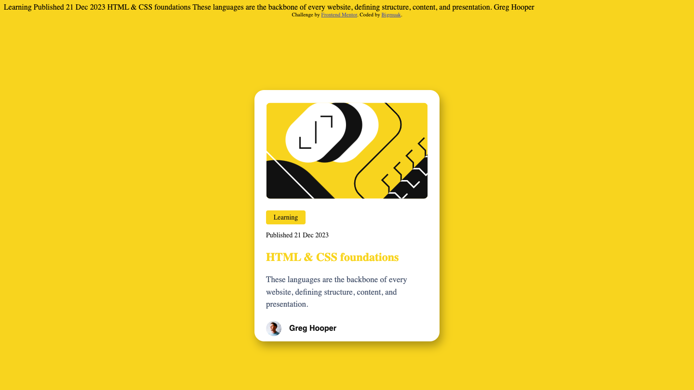

# Frontend Mentor - Blog preview card solution

This is a solution to the [Blog preview card challenge on Frontend Mentor](https://www.frontendmentor.io/challenges/blog-preview-card-ckPaj01IcS). Frontend Mentor challenges help you improve your coding skills by building realistic projects. 

## Table of contents

- [Overview](#overview)
  - [The challenge](#the-challenge)
  - [Screenshot](#screenshot)
  - [Links](#links)
  - [Built with](#built-with)
  - [What I learned](#what-i-learned)
  - [Continued development](#continued-development)
  - [Useful resources](#useful-resources)
- [Author](#author)

### The challenge

Users should be able to:

- See hover and focus states for all interactive elements on the page

### Screenshot

### Links

- Solution URL: https://github.com/Abdulhakeem010/Blog-preview-card
- Live Site URL: https://blog-preview-card-bigmuaks-projects.vercel.app/

### Built with

- Semantic HTML5 markup
- CSS custom properties

### What I learned

-I learned how to navigative through the figma,how to use the transition and hover effect in css and also how to use the box shadow in css.
-I was able to understand how the margin and padding works in css.
-I learned how the font works in css (importing font from google fonts and using font-face.) 

### Continued development

-I need to double down on how to structure my HTMl file 
-Also i need to learn how to use the flexbox and grid in css.
-And then the shadow effect.

### Useful resources

- [Coolors](https://coolors.co) - This is a very nice tool to get the colors for your project, it helped me pick matching color contrast for the hover effect.

## Author

- Website - [Bigmuak]
- Frontend Mentor - [@Abdulhakeem010](https://www.frontendmentor.io/profile/@Abdulhakeem010)

